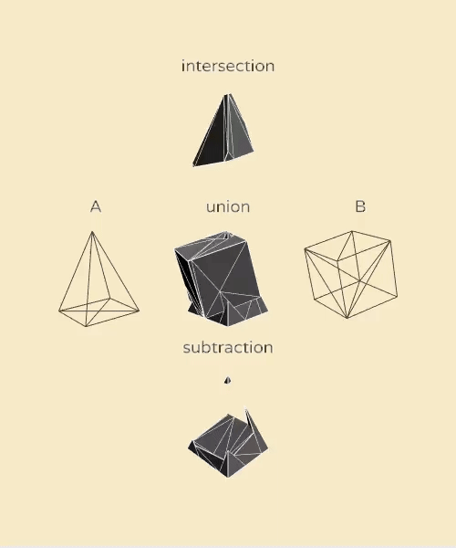

The repository is a collection of Lua libraries for creating triangle meshes from scratch and for constructing more complex objects from geometric primitives.

The intended use is for constructing low-polygon 3D meshes that can then be dynamically adapted during runtime. It works well with Lua's interpreted nature, and enables iterative 3D modeling in live-coding fashion.

Library is designed to be used within [LÖVR](https://github.com/bjornbytes/lovr) framework. With simple substitution of vector and mesh data structures the code could be used elsewhere. Libraries have no inter-dependencies so they can be used separately.

# solids


The module can be used to create some geometric primitives from scratch, and to preform operations on vertices and indices.

```Lua
solids = require('solids')
cube_solid = solids.cube()

function lovr.draw(pass)
  cube_solid:draw(pass, -1, 1, -2)
  cube_solid:draw(pass, mat4(1, 1, -2,  math.pi / 4, 0, 1, 0))
end
```

The advantage over LÖVR built-in primitives is ability to manipulate the mesh before rendering. The disadvantage is that UV maps are not computed, so textures and surface shader effects won't work with them.

The `solid` primitive stores the geometry information in a table:
```Lua
{
  vlist = { {0,0,0,_}, {1,2,3,_}, _} -- list of vertices storing data (positions, normals, colors...)
  ilist = {1, 2, 3, _},              -- flat list of indices; triplets that from the triangles
  sides = {top = {1, 2, 3, _}, _}    -- shape sides mapped to the list of indices
  vbuffer = Buffer(),                -- vertex buffer object for rendering, regenerated as needed
  ibuffer = Buffer(),                -- index buffer object for rendering, regenerated as needed
} -- with metatable accessors to manipulating functions
```

Such primitive can be constructed by calling any of geometry constructors. Currently included primitive solids are:

* `new()` a blank object containing no vertices or indices
* `quad(subdivisions)` a 2D rectangle, with optional subdivision into grid
* `cube()` a simple cube with 6 sides
* `tcube(slant)` a truncated cube (rhombicuboctahedron) with variable slant cutoff
* `bipyramid(segments)` a bipyramid with variable number of sides (a diamond shape)
* `pyramid(segments)`  a pyramid with variable number of sides
* `cylinder(segments)` a prism with variable number of sides
* `sphere(subdivisions)` an icosphere with customizable subdivision steps

While creating the geometry, most of above functions group the vertices into sides. Indices for different sides are stored under `sides` map inside the solid object. For example, a cylinder has bottom and top side. Such table can be used to selectively manipulate only some parts of the mesh.

Note that vertices of adjacent faces are not shared. This allows colocated vertices to have different normals, for example the cube has hard edges when rendered with appropriate shader. Even for cylinder, the curved surface subdivided into segments has separate non-smoothed normal for each segment. This is in line with low-polygon aesthetics which is the intended use of this library.

### Operators on solid shapes

All the operations are immutable; they preserve the originals while creating and returning the new solid objects. The only exception is `updateNormals()` which modifies the solid it is called upon.

#### solid:transform(transform, side_filter)
Used to displace, rotate or scale mesh vertices by applying Mat4 parameter to each. If `side_filter` table is specified, only vertices with indices listed in this table will be affected.

```Lua
cube_solid = solids.cube()
cube_solid = cube_solid:transform(mat4(0,0,0,  2,2,2)) -- double the cube size
cube_solid = cube_solid:transform(mat4(0,0,0,  0.5, 1, 0.5), cube_solid.sides.top) -- shrink the top side
```

#### solid:map(fn, side_filter)

Iterates over all vertices to process them; calls the passed callback function that can modify the vertex information.

```Lua
quad_solid = solids.quad(6)  -- subdivided plane with 6x6 squares
quad_solid:map(
  function(x, y, z) 
    z = (lovr.math.noise(x, y) - 0.5) * 2
    return x, y, z
  end)
```

#### solid:subdivide()
Creates a new mesh with 4x times more geometry than original mesh, while preserving the shape. Each triangle is subdivided into four triangles. The generated triangles don't share any vertices between them. This operation can be used before the mesh is further processed by `map` function, to increase the fidelity of the result.

```Lua
mesh = solids.bipyramid(3)     -- 18 vertices
mesh = solids.subdivide(mesh)  -- 72 vertices
```

#### solid:merge(...)

Combine triangles from two or more solids into a merged solid. By flattening large amount of geometry into a single mesh it is possible to eliminate draw calls and thus improve performance. Note that all the geometry from individual shapes is preserved, even the insides of intersecting shapes. See also the union operator from CSG module, described below.

```Lua
-- merge two or more solids
merged = solidA:merge(solidB)
-- merge together a list of solids
merged = solids.merge(solids.new(), unpack(solids_list))
```

#### solid:updateNormals()

Function calculates *normal* vectors for each triangle and stores them into vertex data. This is often needed inside shaders which can use this per-vertex information to calculate the surface lightning and other effects. This function should be called after all vertex manipulations are done. It is automatically called as needed inside the `solid:draw()` function. Modifies the input solid in-place.

#### solid:flipWinding()

Creates a solid in which triangles have the flipped vertex order (opposite winding). This reverses the face normals.

#### solid:draw(pass, ...)

Used to render the solid mesh inside the pass. Optional transform arguments can be supplied as mat4 object or as set of numerical values; any other arguments supported by `Pass:mesh()` can also be used (start, count, instances).

The function automatically computes normals and constructs the vertex and index buffers needed for rendering the mesh.

```Lua
sphere = solids.sphere(2) -- be careful with subdivisions > 4 as geometry count explodes

function lovr.draw(pass)
  sphere:draw(pass, 0, 2, -2)  -- draw at 0, 2, -2 coordinates
end
```

#### solid:triangleToLine()

Creates a solid in which all the triangles are replaced with lines.  The internal flat list of triangle indices is converted to a flat list of line indices. Edges shared between triangles are not repeated. Such solid can be rendered as a wireframe after `pass:setMeshMode('lines')` is set (this is *not* automatically handled by the `draw()` method).

The intended use is to support custom drawing methods which can give a special treatment to edges.

```Lua
solid = solids.tcube(0.7):triangleToLine()

function lovr.draw(pass)
  for i = 1, #solid.ilist, 2 do -- draw a capsule between each two points
    local i1, i2 = solid.ilist[i], solid.ilist[i + 1]
    local v1, v2 = solid.vlist[i1], solid.vlist[i2]
    pass:capsule(vec3(unpack(v1)), vec3(unpack(v2)), 0.02, 8)
  end
end
```

#### solid:getConnections()

Returns a map of connections between vertex indices in a solid that can be used to gain insight into the mesh.

```Lua
solid = solids:cylinder(5)
graph = solid:getConnections()

-- check if vertices #1 and #2 are connected
if graph[1][2] then
end

-- iterate over all vertices connected to 2
for vi, _ in pairs(graph[2]) do
  local vertex = solid.vlist[vi]
  -- process the vertex
end
```

#### solid:debugDraw(pass, ...)

Visualizes the solid shape in a wireframe mode, together with face normals. This is useful for inspection of meshes during development.


# csg



Constructive Solid Geometry is a technique of modeling 3D shapes by adding, subtracting and intersecting meshes. The csg library is implementation of CSG algorithms using efficient binary space partitioning.

The algorithm was originally constructed by Evan Wallace as JS library and ported to Lua by Tobias Teleman. This codebase fixes and improves on Lua code and adapts it to LOVR's data structures by using `lovr.math` vectors. The result can be used in LOVR once the *CSG* object is converted back to *solid* object.


```Lua
csg = require('solids')
csg = require('csg')
csgA = csg.fromSolid(solidA)
csgB = csg.fromSolid(solidB)
csgU = csgA:union(csgB)       -- or with syntax sugar: csgU = csgA + csgB
csgI = csgA:intersect(csgB)                         -- csgI = csgA * csgB
csgS = csgA:subtract(csgB)                          -- csgS = csgA - csgB
solidU = solids.fromCSG(csgU)
solidI = solids.fromCSG(csgI)
solidS = solids.fromCSG(csgS)
```

The CSG object can be initialized from a solid object (described above), or from similarly formatted table of vertices and indices. If instancing from custom table, the vertices should be stored in a nested table under key `vlist`, and triangle indices in a flat table under key `ilist`.

The CSG library converts the input to a list of polygons. The union/subtract/intersect operations are immutable - they don't modify input CSG objects, they instead create new CSG object and return it as a result.

Limitations:

 * non-intersecting polygons still generate excess geometry 
 * pick better split heuristics than using the first polygon
 * all [issues from original repo](https://github.com/evanw/csg.js/issues) are retained in this implementation

## License

The code in repository is under MIT license.

The sphere generation uses [lovr-icosphere](https://github.com/bjornbytes/lovr-icosphere) code under MIT license.

The csg algorithm originates from [https://github.com/evanw/csg.js](https://github.com/evanw/csg.js) code under MIT license.